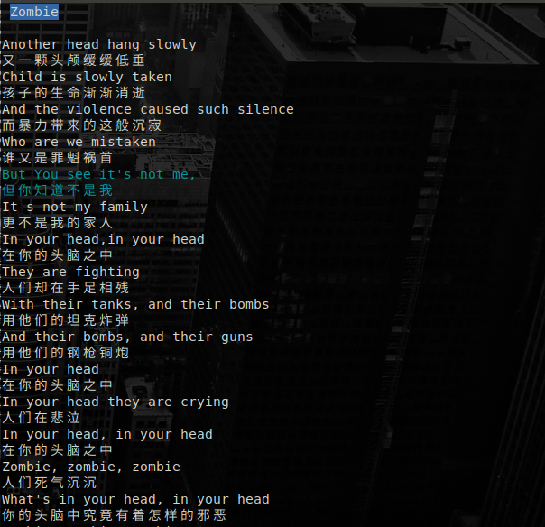
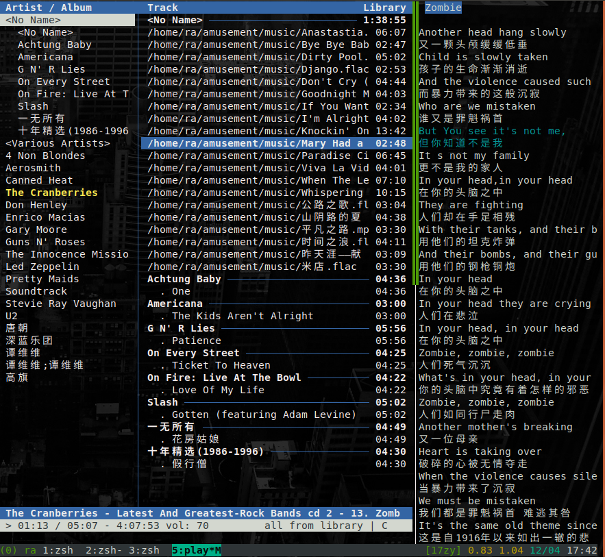

# cmus-lyric
[cmus](https://cmus.github.io/) lyrics [viewer](https://asciinema.org/a/69vGAibC1uvkDBR7WuSecbydd)


# Like


With tmux 



# Install
Linux

`curl -L https://github.com/rockagen/cmus-lyric/raw/master/lyrics -o lyrics`

MacOS

`curl -L https://github.com/rockagen/cmus-lyric/raw/master/lyrics_osx -o lyrics`


`chmod u+x lyrics`


# How
Check cmus current file exist lyric,fetch from music.163.com if not found

# Requirements
`go` compile 

`termui` term ui


# Build
Install termui
```bash
go get -u github.com/gizak/termui
```

Build
```bash
go build cmd/lyrics.go
```

# Run
`./lyrics`

type `q` to quit


happy enjoy!
